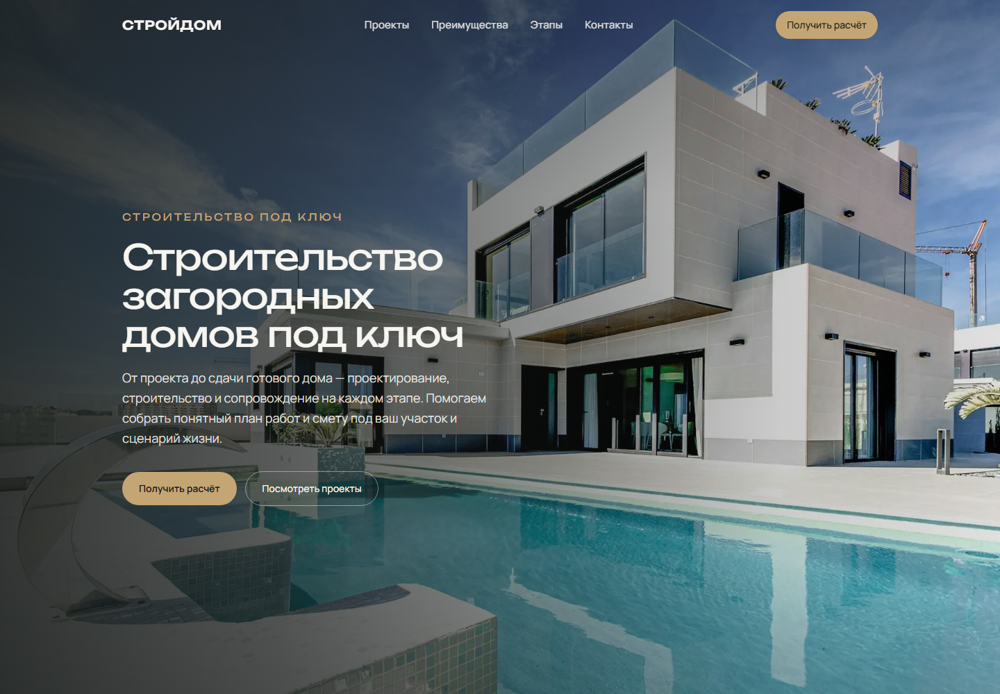
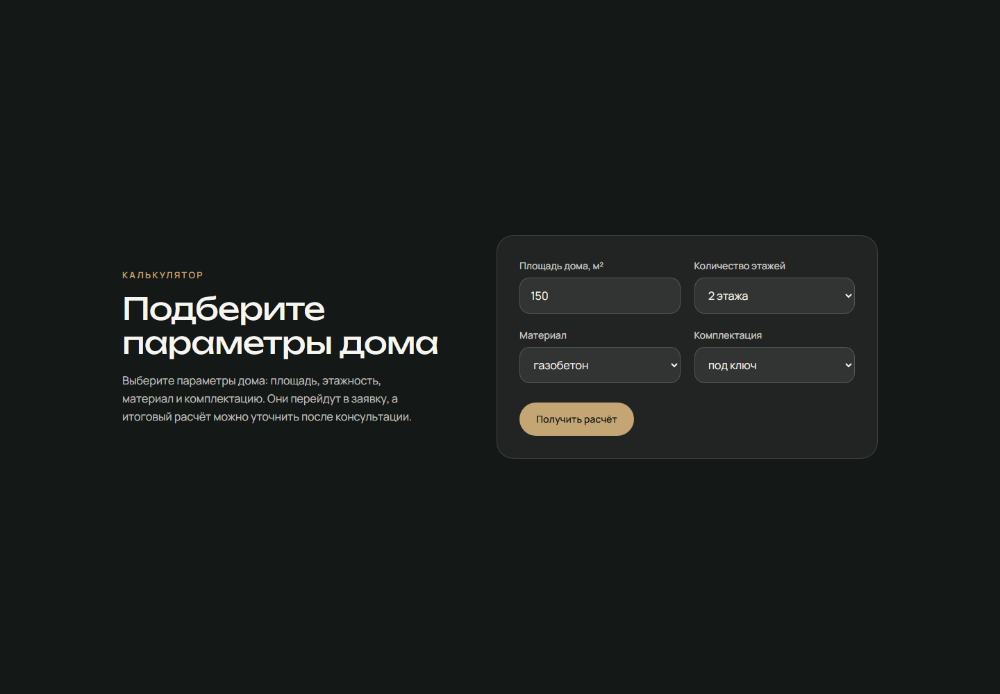
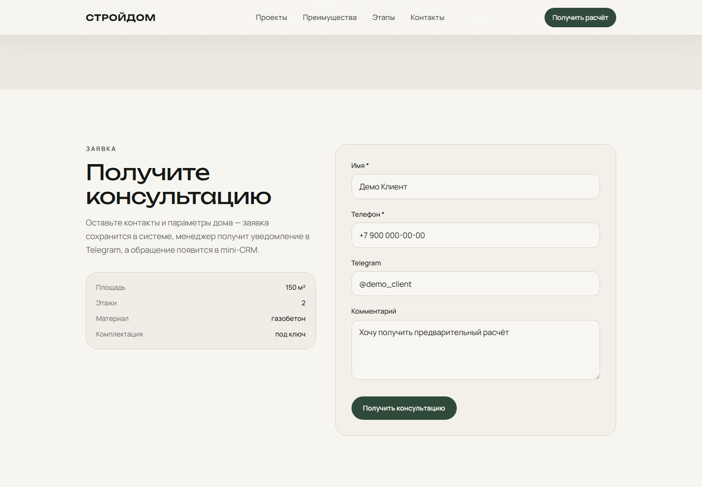
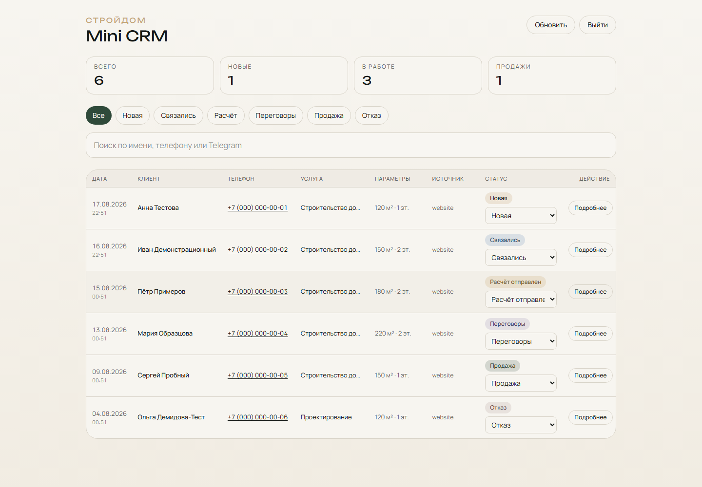
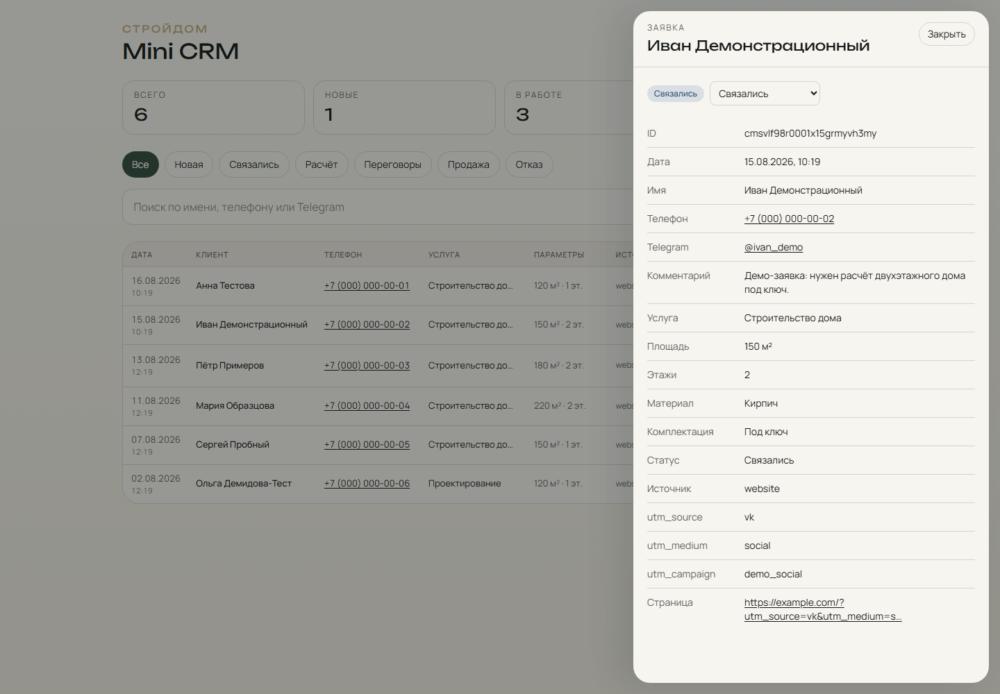
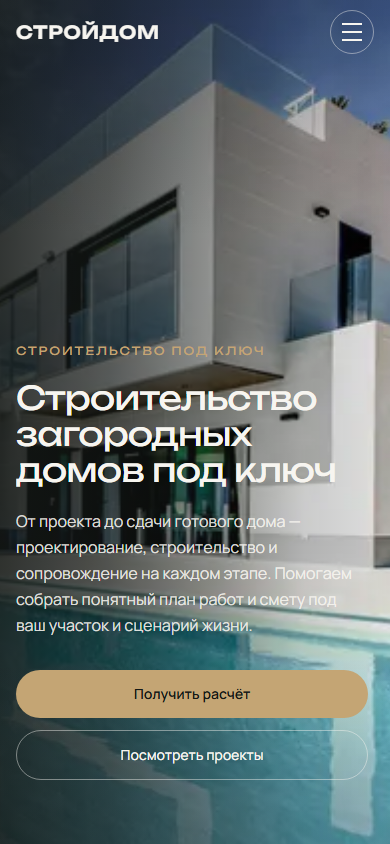
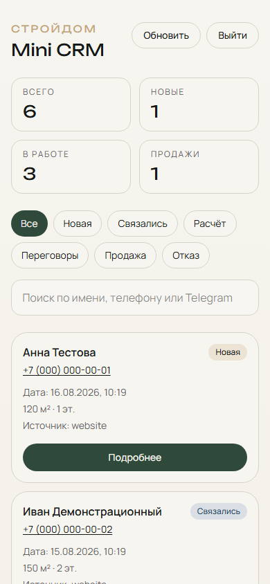

# СТРОЙДОМ

Демонстрационный full-stack проект сайта строительной компании.

**Live demo:** [https://stroydom-project.ru](https://stroydom-project.ru)

GitHub: [O-Simonov/stroydom-demo](https://github.com/O-Simonov/stroydom-demo)

---

## Portfolio demo

- **Live:** https://stroydom-project.ru
- **Тип:** корпоративный сайт + CRM (демонстрационный проект)
- **Ключевой стек:** Next.js 15, React 19, TypeScript, Tailwind, Prisma, SQLite, Zod
- **Кейс:** [`docs/PORTFOLIO_CASE.md`](./docs/PORTFOLIO_CASE.md) · карточка: [`docs/PORTFOLIO_CARD.md`](./docs/PORTFOLIO_CARD.md)

На live demo включён `SITE_MODE=demo`: публичная форма **не сохраняет** персональные данные и не вызывает Telegram. Архитектура production-режима (запись в БД → CRM → Telegram без ПДн в тексте) реализована в коде.

## О проекте

Смоделирован типичный малый бизнес: строительство загородных домов под ключ. Сайт презентует услуги, принимает обращение и — в рабочем (production) режиме — отдаёт его менеджеру в закрытую CRM.

Это **демонстрационный проект для портфолио**, не сайт реальной компании. Контент и сценарии — демонстрационные.

## Что получает бизнес

Посетитель выбирает параметры дома и оставляет контакты. В production-режиме заявка попадает в базу, менеджер может получить уведомление в Telegram (без ПДн в тексте сообщения), обращение появляется в CRM и ведётся по статусам.

```
DEMO:     Посетитель → сайт → simulated response (без записи ПДн)
PRODUCTION: Посетитель → сайт → API → SQLite → CRM (+ Telegram id)
```

## Возможности

### Клиентская часть

- адаптивный лендинг: услуги, проекты домов, этапы работ;
- подбор параметров дома (площадь, этажность, материал, комплектация);
- форма заявки с состояниями загрузки, успеха и ошибки;
- удобная работа с телефона;
- сохранение UTM и адреса страницы входа.

### Back-end

- `POST /api/leads` с серверной валидацией;
- режимы `SITE_MODE=demo|production`;
- в production: хранение заявок в базе и best-effort Telegram (сбой мессенджера не откатывает заявку).

### Mini-CRM

- вход по паролю;
- список обращений, поиск и фильтр по статусу;
- карточка лида с параметрами и источником;
- смена статуса сделки;
- выход из сессии.

### Production

- Ubuntu VPS, Nginx, systemd;
- HTTPS (Let's Encrypt);
- резервные копии SQLite;
- health-check `/api/health`.

## Архитектура

Production-контур (когда `SITE_MODE=production`):

```
Visitor → Next.js → POST /api/leads → Prisma/SQLite → Mini-CRM /leads
                                         ↘ Telegram (id + ссылка CRM)
```

Размещение (без деталей сервера в публичных материалах): HTTPS → Nginx → Next.js → Prisma → SQLite.

Подробности деплоя: [`DEPLOY_VPS.md`](./DEPLOY_VPS.md). Полный portfolio case: [`docs/PORTFOLIO_CASE.md`](./docs/PORTFOLIO_CASE.md).

## Стек

| Слой | Технологии |
|------|------------|
| Frontend | Next.js 15, React, TypeScript, Tailwind CSS |
| Backend | Next.js Route Handlers, Zod, Prisma |
| База | SQLite |
| Интеграции | Telegram Bot API |
| Инфраструктура | Ubuntu, Nginx, systemd, Let's Encrypt, GitHub |

## Безопасность

- секреты только на сервере, не в браузере;
- CRM за паролем, сессия в HttpOnly-cookie (`Secure` в production, `SameSite`);
- серверная валидация, honeypot и базовый rate limit;
- CRM-эндпоинты закрыты без сессии;
- сайт за HTTPS, приложение слушает только localhost за Nginx.

## Скриншоты

**Live demo:** [https://stroydom-project.ru](https://stroydom-project.ru)

Mini-CRM показана на скриншотах ниже; production CRM защищена авторизацией и не предназначена для публичного входа.

### Главная страница



### Подбор параметров



### Заявка



### Mini-CRM



### Карточка лида



### Mobile





Чеклист кадров: [`SCREENSHOTS.md`](./SCREENSHOTS.md) · план: [`docs/PORTFOLIO_SCREENSHOTS.md`](./docs/PORTFOLIO_SCREENSHOTS.md).
Кейс: [`docs/PORTFOLIO_CASE.md`](./docs/PORTFOLIO_CASE.md) · также [`CASE.md`](./CASE.md) · [`PORTFOLIO.md`](./PORTFOLIO.md)

## Локальный запуск

```bash
git clone https://github.com/O-Simonov/stroydom-demo.git
cd stroydom-demo
npm ci
cp .env.example .env
```

В `.env` задайте `DATABASE_URL`, при необходимости Telegram и CRM-переменные (значения не коммитить).

```bash
npx prisma generate
npx prisma migrate deploy
npm run dev
```

Открыть [http://localhost:3000](http://localhost:3000). CRM: `/leads`.

## Статус проекта

СТРОЙДОМ — демонстрационный проект, созданный для портфолио.  
Названия компании, контент и заявки используются исключительно в демонстрационных целях.
