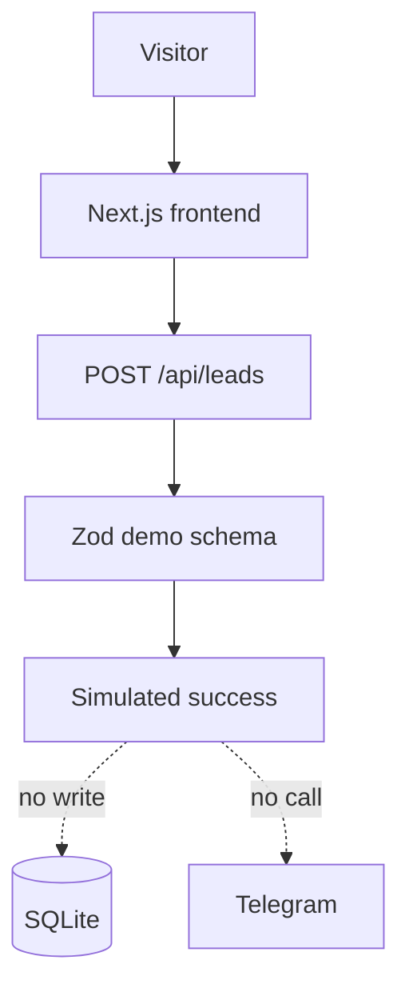
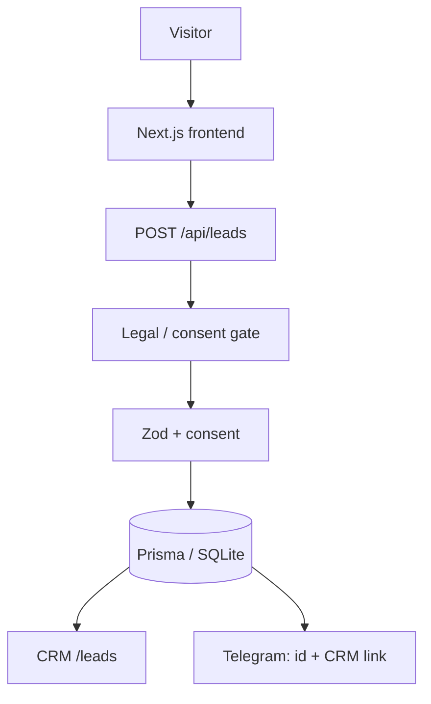

# STROYDOM

## Демонстрационный корпоративный сайт строительной компании

**Тип:** корпоративный сайт + собственная CRM для заявок  
**Статус:** демонстрационный / portfolio project  
**Live demo:** [https://stroydom-project.ru](https://stroydom-project.ru)  
**CRM (вход):** [https://stroydom-project.ru/leads/login](https://stroydom-project.ru/leads/login)  
**Репозиторий:** [O-Simonov/stroydom-demo](https://github.com/O-Simonov/stroydom-demo)

---

## О проекте

STROYDOM — полнофункциональный **демонстрационный** проект: современный сайт строительной компании с формой обращения и закрытой CRM для работы с заявками.

Это не сайт реального заказчика и не отчёт о бизнес-результатах. Контент и сценарии смоделированы так, чтобы показать, как может выглядеть и работать цифровой контур малого бизнеса в строительстве.

---

## Цель

Показать на одном живом примере полный цикл: от презентации услуг на сайте до появления заявки у менеджера в собственной CRM — с учётом адаптивности, базового SEO, безопасности и архитектуры под персональные данные.

---

## Задача

Разработать современный сайт строительной компании, который одновременно:

- презентует услуги и вызывает доверие;
- помогает посетителю сформулировать параметры дома;
- принимает обращения через форму;
- даёт менеджеру закрытый интерфейс для работы с заявками;
- корректно работает на мобильных устройствах;
- имеет техническую SEO-базу;
- разворачивается на собственном сервере;
- разделяет демонстрационный режим (без сохранения ПДн с публичной формы) и режим реальной обработки заявок.

---

## Что было реализовано

- корпоративный лендинг: hero, преимущества, проекты домов, этапы работ, портфолио-блоки, CTA;
- параметрический подбор дома (площадь, этажность, материал, комплектация) — без денежного «калькулятора цены»;
- форма заявки с валидацией, состояниями UI, honeypot и серверным rate limit;
- захват UTM и URL страницы входа;
- API заявок на Next.js;
- хранение заявок в SQLite через Prisma (в production-режиме);
- mini-CRM: вход по паролю, список, поиск, фильтр по статусу, карточка лида, смена статуса;
- уведомление в Telegram в production-режиме (в тексте — id заявки и ссылка в CRM, без ПДн);
- режимы `SITE_MODE=demo|production`;
- страницы privacy / согласие / cookies;
- robots.txt, sitemap, metadata, Open Graph, JSON-LD WebSite;
- security headers (в т.ч. CSP, HSTS в production Node);
- production-контур: Linux VPS, Nginx, systemd, HTTPS, резервные копии БД.

Подробная матрица заявлений: [`PORTFOLIO_FEATURE_MATRIX.md`](./PORTFOLIO_FEATURE_MATRIX.md).

---

## UX/UI

Визуальный язык — спокойный «строительный» корпоративный стиль: выразительная типографика, полный hero, понятная навигация по якорям, крупные CTA. Форма и CRM спроектированы как рабочие интерфейсы, а не декоративные блоки.

На мобильных устройствах сохраняется читаемость секций; в CRM список переключается на карточки.

---

## Главная страница

Типичный путь посетителя:

1. Hero и ценностное предложение.  
2. Преимущества и проекты.  
3. Этапы работ.  
4. Подбор параметров.  
5. Форма обращения.  
6. Footer с навигацией и ссылками на правовые страницы.

На live demo отображается раскрытие о демонстрационном характере проекта.

---

## Лидогенерация

Публичная форма собирает обращение (имя, телефон, опционально Telegram и комментарий; в production — явное согласие).

**На текущем live demo (`SITE_MODE=demo`):**

- заявка **не** записывается в базу;
- Telegram **не** вызывается;
- пользователь видит сообщение о демонстрационном режиме.

**В режиме production (архитектура готова):**

- серверная валидация и проверка согласия;
- запись в БД;
- best-effort уведомление в Telegram;
- появление лида в CRM.

---

## CRM

Заявки не обязаны уходить только «на почту» или в личный мессенджер владельца. Для проекта реализована **собственная закрытая CRM**.

### CRM FEATURES (реализовано)

- вход по паролю, защищённая сессия (HttpOnly cookie);
- список заявок (до последних записей API), поиск и фильтр по статусу;
- статусы: Новая → Контакт → КП → Переговоры → Сделка / Отказ;
- счётчики (всего / новые / в работе / продажи);
- таблица на desktop, карточки на mobile;
- карточка лида с параметрами дома и источником;
- смена статуса без ухода со страницы;
- выход из сессии;
- маршруты CRM закрыты от индексации (`noindex`, disallow в robots).

### CRM POSSIBLE EXTENSIONS (не реализовано)

- роли нескольких менеджеров;
- заметки и задачи по лиду;
- телефония / коллтрекинг;
- WhatsApp / email-automation;
- интеграция Bitrix24 / amoCRM;
- полноценная воронка с SLA и аналитикой маркетинга.

---

## Backend

- Next.js Route Handlers: создание/чтение/обновление заявок, login/logout CRM, health;
- Zod-схемы на сервере;
- Prisma ORM;
- разделение demo/production логики на уровне API;
- rate limiting и honeypot для публичного POST.

---

## Работа с данными

- SQLite как файл БД вне каталога кода (чтобы обновление релиза не затирало данные);
- Prisma migrations (в т.ч. поля evidence согласия для production);
- исторические записи не «дозаполняются» фейковым согласием.

---

## Безопасность

Реализованы практические меры, достаточные для демонстрации зрелого подхода:

- HTTPS на live;
- закрытый доступ к CRM;
- Secure / HttpOnly session cookie (в production Node);
- серверная валидация ввода;
- security headers: CSP, HSTS, X-Content-Type-Options, frame protection, Referrer-Policy, Permissions-Policy.

Формулировка для портфолио: **базовая production-oriented защита**, без заявлений «невозможно взломать» или «100% защита».

---

## SEO

Подготовлена **техническая SEO-база**:

- title / description / canonical;
- Open Graph и Twitter card;
- `robots.txt` и `sitemap.xml` (без CRM и API);
- JSON-LD типа WebSite (без вымышленных рейтингов и отзывов);
- семантическая структура страницы;
- мобильная адаптивность.

Не заявляется позиция в поисковой выдаче.

---

## Персональные данные и compliance architecture

Архитектура учитывает типичные требования к обработке персональных данных на коммерческих сайтах в РФ — **без утверждения полной юридической «сертификации»**.

На уровне продукта:

- отдельные страницы политики, согласия и cookies;
- production: обязательное согласие и запись evidence;
- demo: публичная форма не сохраняет ПДн;
- owner configuration и release gate перед включением production-режима;
- Telegram без текста с ПДн.

Для реального клиента требуется отдельная owner configuration и юридическая приёмка.

---

## Адаптивность

Интерфейс рассчитан на desktop и mobile. Публичные и CRM-экраны проверены на типовых viewport (около 1440×900 и 390×844).

---

## Технологический стек

| Область | Стек |
| --- | --- |
| Frontend | Next.js 15.5, React 19, TypeScript, Tailwind CSS 4 |
| Backend | Next.js Route Handlers (Node) |
| Database | SQLite |
| ORM | Prisma 6.19 |
| Validation | Zod 4 |
| Authentication | пароль CRM + подписанная session cookie |
| Deployment | Linux VPS, Nginx, systemd, Node.js |
| SEO | metadata, robots, sitemap, OG, JSON-LD |
| Security | HTTPS, headers, validation, authz CRM |

---

## Архитектура

### DEMO (текущий live)



### PRODUCTION (архитектура в коде)



Размещение приложения:

```
Internet → HTTPS → Nginx → Next.js (loopback) → Prisma → SQLite
```

---

## Production deployment

Проект развёрнут на Linux VPS: приложение под systemd, reverse proxy Nginx, HTTPS, база вне каталога кода, резервное копирование SQLite, health-check, контролируемые миграции при релизах.

В портфолио **не** публикуются IP, SSH-пользователи, пути сервера и секреты.

---

## Что демонстрирует этот проект

- полный цикл «сайт → заявка → CRM»;
- full-stack на современном Next.js;
- продуктовое мышление (demo vs production);
- внимание к SEO и security baseline;
- готовность к российскому контуру персональных данных на уровне архитектуры;
- умение вывести проект в production, а не оставить в localhost.

---

## Возможности развития

См. [`CASE_SALES_POSITIONING.md`](./CASE_SALES_POSITIONING.md): каталог, CMS, интеграции CRM, аналитика, чат, оплаты, SEO-страницы услуг и др. — как **возможные расширения**, не как текущий функционал.

---

## Live Demo

- Сайт: https://stroydom-project.ru  
- CRM login: https://stroydom-project.ru/leads/login  

Публичная форма на demo **не создаёт** реальные заявки.

---

## Статус проекта

| Поле | Значение |
| --- | --- |
| Характер | Демонстрационный / portfolio |
| Live | Да |
| Режим публичной формы | `SITE_MODE=demo` |
| Deploy commit (ориентир) | `09565b8` |

---

## Позиционирование (краткие формулировки)

**CASE TITLE:** STROYDOM  

**CASE SUBTITLE:** Демонстрационный корпоративный сайт строительной компании с CRM  

**ONE-LINE:** Современный сайт загородного строительства с формой заявок и собственной закрытой CRM.  

**SHORT:** Полнофункциональный демонстрационный проект: адаптивный корпоративный сайт, параметрический подбор дома, API заявок, SQLite, mini-CRM и production-развёртывание. На live demo публичная форма не сохраняет персональные данные.  

**FULL:** см. разделы выше.
